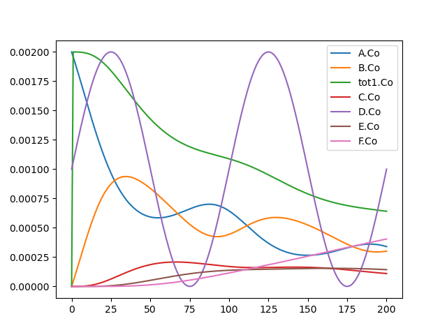
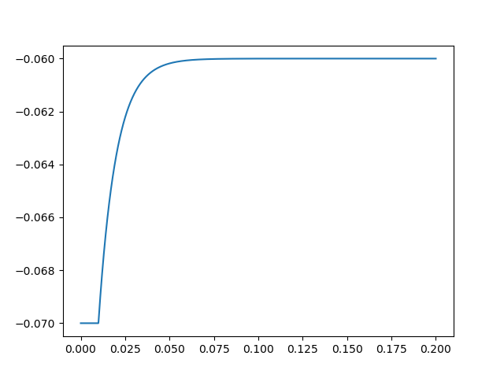

.. _getting-started-python:

***********************************************
Getting started with python scripting for MOOSE
***********************************************

.. figure:: ../../images/Gallery_Moose_Multiscale.png
   :alt: Multiple scales in moose
   :scale: 100%

   MOOSE can simulate across scales: from biochemical reactions and
   diffusion to biophysical neuron models and neural networks.

MOOSE is released as a Python module. In this document we assume the
user has some familiarity with Python, and has already installed it
locally. Otherwise, you can go through any of the many Python
tutorials online. If you do not have moose installed, check out the
installation instructions see :ref:`installing-moose`

.. _howto-use-documentation:

How to use this documentation
=============================

Lines starting with `>>>` indicate Python prompt. That is when you run
`python` from a command shell (e.g., `bash`, `zsh`, `powershell`), the
Python interpreter fires up and waits with this prompt for your
input. The text after the `>>>` is the statement you have to type and
enter for Python to run. This is the interactive mode. This tutorial
assumes that all the Python commands are entered squentially in a
single session.

You can also write down a series of Python statements in a text file
with extension `.py` (e.g., `mysimulation.py`), this is called a
script. You can then run it from the command shell like `python
mysimulation.py`. When we show such scripts in the documentation, they
will be normally hidden, like this:

.. toggle::
   .. code-block:: python
      def hello_world():
          """Prints hello world"""
          print('Hello, world')
          return 42

.. _importing-moose:

Import moose and simulate a model
=============================

In a python script you must `import` modules to access the
functionalities they provide. In order to use moose, you need to
import it within a python environment or at the beginning of your
python script::

  >>> import moose

This make the ``moose`` module available for use in Python.

The easiest way to do a simulation in MOOSE is to load an existing
model and simulate it. MOOSE supports multiple model description
formats: SBML, NeuroML, GENESIS kkit and cellproto (.p) files. There
are some such examples in the `moose-core
repository<https://github.com/MooseNeuro/moose-core>`_ in the
`tests/data` subdirectory.

Download the example `kkit` model `kkit_objects_example.g
<https://github.com/MooseNeuro/moose-core/blob/master/tests/data/kkit_objects_example.g>`_
in your current working directory. Then use ``moose.loadModel`` to load a
model::

  >>> model = moose.loadModel('kkit_objects_example.g', 'model', 'gsl')

Then initialize parameters of the model with ``moose.reinit``::

  >>> moose.reinit()

Then start the simulation for 20 seconds with ``moose.start``::
  
  >>> moose.start(20.0)

This model includes data recording setup. To plot the data you can use
 `matplotlib`. We are using the `pylab` interface of matplotlib here::

  >>> import pylab

Now go through the tables storing recorded data and plot them using a
`for` loop in Python::

  >>> for x in moose.wildcardFind( '/model/#graphs/conc#/#' ):
  ...     pylab.plot( x.vector, label=x.name )
  ...
  [<matplotlib.lines.Line2D object at 0x000002487720B850>]
  [<matplotlib.lines.Line2D object at 0x000002487723A850>]
  [<matplotlib.lines.Line2D object at 0x000002487725EF10>]
  [<matplotlib.lines.Line2D object at 0x000002487725F950>]
  [<matplotlib.lines.Line2D object at 0x000002487A684550>]
  [<matplotlib.lines.Line2D object at 0x000002487A685110>]
  [<matplotlib.lines.Line2D object at 0x000002487A685C10>]
  >>> pylab.legend()
  <matplotlib.legend.Legend object at 0x000002487A686690>
  >>> pylab.show()

This should show the concentrations of various molecules in the model as below:

   Plot of concentrations over time in a kkit model loaded and simulated in MOOSE.		  
  
  
You can find more such model files from `moose-examples repository
  <https://github.com/MooseNeuro/moose-examples>`_.

.. _access-docs:

Accessing documentation
=======================

MOOSE comes with builtin documentation. You can use Python's built-in
``help`` function to read the top-level documentation for the moose
module::

        >>> help(moose)

This will give you an overview of the module. This may be too much at
this point. Press ``q`` to exit the pager and get back to the
interpreter. You can also access the documentation for individual
classes and functions this way::

        >>> help(moose.connect)

MOOSE has built-in documentation in the C++-source-code independent of
Python. The ``moose`` module has a separate ``doc`` function to extract
this documentation::

        >>> moose.doc('Compartment')

The class level documentation will show whatever the author/maintainer
of the class wrote for documentation followed by a list of various kinds
of fields and their data types. This can be very useful in an
interactive session.

Each field can have its own detailed documentation::

        >>> moose.doc('Compartment.Rm')

	
.. _show-existing-elements:

See what already exists
===========================

MOOSE organizes model components and other objects (elements) in a
`tree structure
<https://en.wikipedia.org/wiki/Tree_(abstract_data_type)>`_ similar to
directory structures in major operating systems. To traverse this
element tree, MOOSE provides builtin functions like standard Unix
commands for traversing directory tree. These are `le` for *list
element* (like Unix `ls`), `ce` for *change element* (like Unix `cd`),
`pwe` for *present working element* (like Unix `pwd`).

After you are done with the first example, you can get back to a clean
slate by deleting the `model` element::

  >>> moose.delete('/model')

.. DANGER::
   Do not try to access a deleted moose object via the Python variable that refers to it.
  
After importing moose, you can print the list of elements under your
present working element::

  >>> moose.le()

This prints::  

    Elements under /
        /Msgs
        /clock
        /classes
        /postmaster

This tells you that you are currently under the element `/`, the root
of the element tree and that there are already four elements under
`/`. These are special elements created at startup for internal use by
MOOSE. You should never modify or delete them.

.. _creating-elements:

Creating elements (objects)
===========================

Biological entity types like neurons, synapses, enzymes, and
reactions, are represented by different `classes` in MOOSE. Individual
instances of these classes are `objects` (also called `elements` in
MOOSE). They are the building-blocks of models in MOOSE.

We have already seen the system objects created at startup. Now let us
create some objects of our own. This can be done by invoking MOOSE
class constructors (just like regular Python classes)::

  >>> model = moose.Neutral('/model')
	

This creates a ``Neutral`` object named ``model``. ``Neutral`` is the
base of all MOOSE classes. That means every other moose class inherits
the fields available in ``Neutral``. Its only use is as a container
for other elements.

You can use `le` to show the elements under `/` again and see that
`/model` has been added to the list::

  >>> moose.le()
  Elements under /
      /Msgs
      /clock
      /classes
      /postmaster
      /model
  

We can create something under ``model`` ::

  >>> soma = moose.Compartment('/model/soma')

Every element has a unique path. This is a concatenation of the names of
all the objects one has to traverse starting with the root (`/`) to reach that
element. ::

  >>> print(soma.path)
  /model[0]/soma[0]

	
You can also print the name of the element::

  >>> print(soma.name)
  soma

You can display the elements under model using `le`::

  >>> moose.le('/model')
  Elements under /model[0]
    /model[0]/soma

  
Notice that without any argument, `le` lists elements under the
working element. You must pass the path of an existing element as a string
argument to `le` to list the elements under that path.

.. note:: Functions take and element or its path as argument
   
	  ``moose.le(...)``, ``moose.ce(...)``,
	  ``moose.showfield(...)``, ``moose.showmsg(...)`` work with
	  both a string specifying the path of an element and an
	  element.

	  Thus `moose.le('/model/soma')` and `moose.le(soma)` produce
	  the same result.
	  

.. _traversing-element-tree:

Traversing the element tree
===========================

Just like `cd` command for traversing directories, MOOSE provides a
`ce` function to traverse the element tree. After creating the element
`/model` above, you can make it your working element.

You can check your current working element with `pwe`::

  >>> moose.pwe()
  /
  
then change your working element to `/model` by calling `ce`::

  >>> moose.ce('/model')

and verify that your present working element is indeed `/model`::

  >>> moose.pwe()
  /model[0]

.. _relative-and-absolute-path:

Absolute path and relative path
===============================

The idea of absolute and relative path comes from convetions in
directory paths in operating systems. When a path starts with a `/`,
it is an absolute path, starting with the *root* element. In contrast,
if the path does not start with `/`, then it it is considered relative
to the present working element.

We show this with an example. At this point, our present working
element is `/model` and we already have a `Compartment` object named
`soma` under this. We can change to this object with `ce` and a
relative path::

  >>> moose.ce('soma')
  >>> moose.pwe()
  /model[0]/soma[0]
  
Like directory conventions, relative path `.` resolves to the present
working element, and `..` resolves to the parent of the present
working element. We can change our working element back to `root` like
this::

  >>> moose.ce('../..')

  
and confirm that it worked::
  
    >>> moose.pwe()
    /

This applies to object creation also::
  
  >>> moose.ce('/model')
  >>> dummy = moose.Neutral('dummy')
  >>> print(dummy.path)
  /model[0]/dummy[0]

.. tip::
   Instead of typing out whole path, you can compose the paths using f-strings in Python like this::

     >>> soma = moose.Compartment(f'{model.path}/soma')
     
    
.. _accessing-fields:

Accessing fields
================

MOOSE objects keep track of properties of the entities they
represent. These are called `fields` or `attributes`. You can display
the fields and their values using the ``showfield`` function::

  >>> moose.showfield('/model')
  [/model]
  name          = model
  className     = Neutral
  tick          = -1
  dt            = 0.0

As we mentioned earlier, ``Neutral`` is the base class for all moose
classes. It has a `name` field that uniquely identifies it among the
children of its parent element. A `className`, which is `Neutral`,
unsurprisingly! The `tick` and `dt` fields are for advanced use and
are detailed in :ref:`advanced-scheduling`.

Now let us look at a more interesting element. The ``Compartment``
class represents a small sections of a neuron, i.e., a tiny cylinder
of cell-membrane wrapping around cytoplasm. It can be modeled as a
parallel RC circuit:

.. figure:: ../../images/neuronalcompartment.jpg
   :alt: Passive neuronal compartment

   Passive neuronal compartment modeled by `Compartment` class

``Compartment`` element has fields to store the properties of this
circuit. You can see the names and values of all the fields using
`showfield` function::

  >>> moose.showfield('/model/soma')
  [/model[0]/soma]
  name          = soma
  className     = Compartment
  tick          = 3
  dt            = 5e-05
  Cm            = 1.0
  Em            = -0.06
  Im            = 0.0
  Ra            = 1.0
  Rm            = 1.0
  Vm            = -0.06
  diameter      = 0.0
  initVm        = -0.06
  inject        = 0.0
  length        = 0.0
  x             = 0.0
  x0            = 0.0
  y             = 0.0
  y0            = 0.0
  z             = 0.0
  z0            = 0.0

.. note:: You can also pass the Python object to ``moose.showfield``,
          like ``moose.showfield(soma)`` to get the same output.

The first four fields (`name` ... `dt`) are inherited from
``Neutral``. You can see the builtin documentation for any field with
``moose.doc``::

  >>> moose.doc('Compartment.Cm')
  Query: Cm
  Cm: double - ValueFinfo
  Membrane capacitance  

`Cm` is the total membrane capacitance of the compartment, `Rm` is its
total membrane resistance. `Vm` is its voltage, `Em` represents the
resting membrane potential, and `initVm` is the value `Vm` will be set
to at the start of the simulation.

The `diameter`, `length`, `x`, `y`, `z`, and `x0`, `y0`, `z0` are not
directly used for simulation, but for display and other
conveniences. (`x0`, `y0`, `z0`), and (`x`, `y`, `z`) are the
coordinates of the two ends of the cylindrical compartment axis, and
modifying them will update the length of the compartment. `length` is
set to `0` to indicate spherical compartment.

All these fields have some default value which you can modify
according to your model::

  >>> soma.Cm = 1e-9
  >>> soma.Rm = 1e7
  >>> soma.initVm = -0.07
  >>> soma.Em = -0.07

Apart from ``moose.showfield``, you can of course print them directly
in Python::

  >>> print(soma.Cm)
  1e-09

.. _note-unit-system:

.. note:: About unit system in computer models

	  In the above code you may have noticed that we did not specify the
	  unit of any of the fields. Computers work with numbers, and not
	  physcal quantities. Thus computer models are unit agnostic. Unit
	  system is a convention imposed and implied by the modeler. Take, for
	  example, the most famous equation from Physics, :math:`E=mc^2`. The
	  equation has no notion of unit, and as long as you put the values of
	  `m` and `c` in a consistent unit system, you will get the value of `E`
	  in the same unit system.

	  MOOSE also solves such equations to calculate the field values of
	  model componets over time, and as long as you follow a consistent unit
	  system, you should get the results in the same unit system.

	  Thus, in the `soma` example above, if the capacitance is in
	  `Farads` and the resistance in `Ohms`, then the charging
	  time constant of the RC circuit would be :math:`1e-9 \times
	  1e7 = 0.01` in `seconds`. If you used `nano Farads` as the
	  unit of capacitance and `mega Ohms` as the unit of
	  resistance, then the magnitudes for `Cm` and `Rm` would have
	  been `1` and `10` respectively, and the time constant would
	  have been :math:`1 nF \times 10 M\Omega = 10 ms = 0.01 s`.
	  
	  To avoid confusion and horrible bugs we recommend using SI
	  units throughout, and converting quantities obtained in
	  other units into SI before assigning them to fields of MOOSE
	  elements. You are likely to encounter this when using
	  experimental data in neuroscience, where quantities are
	  usually expressed in physiological units (`mV` for voltage,
	  `ms` for time, `nA` for current) for convenience. Also,
	  dimensions of neuronal structures are expressed in `microns` (
	  :math:`\mu m = 10^{-6} m` ).

	  One issue is that computers have limited capacity of
	  `representing numbers
	  <https://en.wikipedia.org/wiki/Floating-point_arithmetic>`_, and if
	  the unit choice renders the magnitude of a quantity too small, then
	  the results can lose precision. This was a problem with
	  `single-precision arithmetic <https://en.wikipedia.org/wiki/Single-precision_floating-point_format>`_ used in old times. But MOOSE uses `double precision floating point numbers <https://en.wikipedia.org/wiki/Double-precision_floating-point_format>`_
	  wherever possible, and all realistic quantities in SI unit are covered
	  in this range.
	 

.. _traversing-tree-by-parent-child:

Traversing the element tree by parent/child fields
==================================================

A tree data structure in computer science can be defined by a root
node, and the children of each node. MOOSE keeps track of its element
tree through two fields present in every element: `parent` and
`children` (these are skipped by ``moose.showfield`` by default for
maintaining readability)::

  >>> print(soma.parent)
  <moose.Neutral id=486 dataIndex=0 path=/model[0]>
  >>> print(model.children)
  [<Id: id=487 path=/model[0]/soma class=Compartment>, <Id: id=488 path=/model[0]/dummy class=Neutral>]

Notice that `children` is a list, whereas `parent` is a single
element. This is by definition of tree. A tree node can have at most
one parent (root has 0), but any number of children.

.. note:: vec(tor) or array elements
	  
	  Another important distinction to note here is that the
	  entries in the `children` list have a different
	  representation than `parent`.  This is because they are of a
	  different kind: vector or array element. MOOSE objects are
	  vectorized, and the elements we created so far are just
	  single-element vectors. More on this at :ref:`vec-element`.	  

You can use these fields to traverse the tree::
  >>> moose.ce(model.parent)
  >>> moose.pwe()
  /

However, entries in `children` list are ``moose.vec`` objects, which
are like arrays. You must index into a ``moose.vec`` to get its
elements::
  
  >>> child = model.children[0]    # this gets the first entry of `model`'s `children`
  >>> moose.ce(child[0])           # `child[0]` gets the first element of `child` vec
  >>> moose.pwe()
  /model[0]/soma[0]

.. _connecting-components:

Connecting model components
===========================

Elements are the building blocks of models, but they need some
plumbing (or wiring, if you prefer electrical terms) to actually build
a model. This is done with ``moose.connect(...)`` function.

We already created a ``Compartment`` that models the equivalent
electrical circuit of a neuronal segment. In real experiments with
neurons in the brain, one usually injects a step current. In MOOSE,
the ``PulseGen`` class is designed to deliver specified level output
for a given time.

Let us create a ``PulseGen`` to deliver `1 nA` current to the `soma`::

  >>> stim = moose.PulseGen('/model/stimulus')
  >>> stim.baseLevel = 0.0
  >>> stim.firstLevel = 1e-9
  >>> stim.firstDelay = 10e-3
  >>> stim.firstWidth = 1e9

Here we set the baseline output of the ``PulseGen`` element to 0, and
after `10 ms` its output to jump to `1 nA`, and it will stay so for `1
billion s`, much longer than our simulated time.

Now to stimulate our `soma` with the output of the ``PulseGen``, we
must connect the latter to the soma. Here stimulating means injecting
a current into the soma, and it has a special field to receive such
input, named `injectMsg`. This type of fields intended to receive a
value from another object, are called `dest` fields (short for
`destination`). Similarly, fields from which an object can send a
value are called `src` fields (short for `source`).

To send the output of `stim` as injected current into `soma`, we have
to connect the `src` field `output` of `stim` to the `dest` field
`injectMsg` of `soma`::

  >>> moose.connect(stim, 'output', soma, 'injectMsg')

.. _running-simulation:

Running the simulation
======================

To run the simulation you first need to call the ``moose.reinit``
function to (re)initialize various fields on the model components, for
example `soma.Vm` will be set to `soma.initVm`. Moreover, this
function does some internal setup::
  
  >>> moose.reinit()

Now you can start the simulation for any given time using
``moose.start`` function::
  
  >>> simtime = 200e-3
  >>> moose.start(simtime)

Again, the meaning of time depends on the unit system you are
using. And as we are using SI units, here the simulation run time is
`100 ms`.
  
You can check the final membrane voltage of `soma`::

  >>> print(soma.Vm)
  -0.06000000005574865

You can verify that `1 nA` current applied to the RC circuit will
produce a voltage increase of :math:`1e-9 A \times 1e7 \Omega = 0.01
V` at steady state (when the capacitor is fully charged). Since the
resting membrane potential `Em = -0.07`, this is indeed `-0.07 V +
0.01 V = -0.06 V` within reasonable precision.

.. _recording-data:

Recording data over time
========================

We just checked that the model indeed computes the expected
result. But steady state values are hardly interesting by
themselves. The primary purpose of simulations in MOOSE to study the
dynamics of biological entities. MOOSE indeed computed the timecourse
of the membrane voltage of `soma`, but we must record it at regular
time intervals in order to see its evolution. This is done using
``Table`` objects.

For every `value` field, like `Vm` of ``Compartment``, moose classes
have a corresponding `dest` field `get{FieldName}`. ``Table`` class
has a `src` field named `requestOut` which can be connected such
`dest` fields to sample the value of the field at regular intervals::

  >>> vm_tab = moose.Table('/model/Vm')
  >>> moose.connect(vm_tab, 'requestOut', soma, 'getVm')

After connecting the `requestOut` source field of `vm_tab` to `getVm`
destination field of `soma` as above, we can reset the model and run the
simulation again::

  >>> moose.reinit()    # reset the model, set all fields back to initial values
  >>> moose.start(simtime)

The table has a field `vector` which is accessible as a `numpy` array,
and gives us the value of `soma.Vm` sampled at the interval
`vm_tab.dt`.

.. note:: `dt`, the simulation time step 

	  Every moose element has a `dt` field, which is called *time
          step* in numerical integration over time. This is the
          simulated time interval at which the main computation of
          each moose object is carried out. In case of
          ``moose.Compartment`` it is the calculation of the membrane
          voltage `Vm`, and for ``moose.Table`` it is sampling the
          target field of `requestOut`.

	  
.. _plotting-data:

Plotting the recorded data
==========================

With the data recorded in `vm_tab` you can easily plot the membrane
voltage of `soma` over time using `numpy` and `matplotlib` (or any
other plotting library)::

  >>> import numpy as np
  >>> t = np.arange(len(vm_tab.vector)) * vm_tab.dt   # create array of time points
  >>> pylab.plot(t, vm_tab.vector)
  >>> pylab.show()

This should show you the charging curve of the membrane capacitance:

   Simulated membrane potential of a passive neuronal compartment with a step current injection

  
  

*****
TODO
*****

.. _load-model:
Details on loading model

.. _vec-element:
Discussion of vec / Id / ObjId

.. _msg-fields:
Discussion of src and dest fields

.. _element-fields:
Discuss element fields
